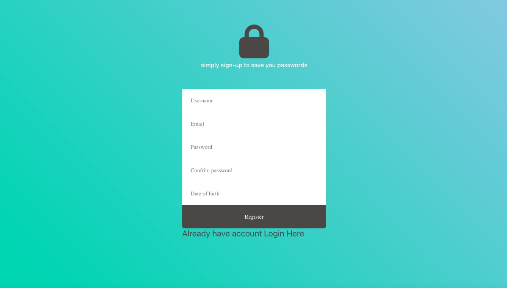
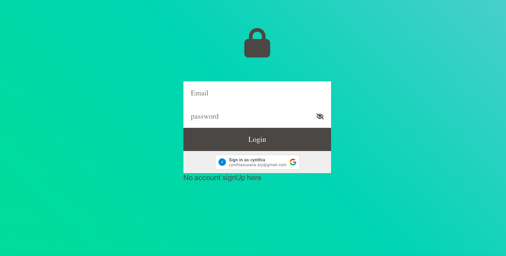
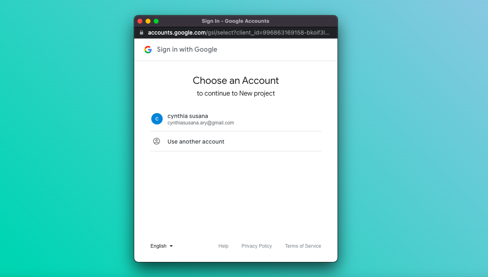
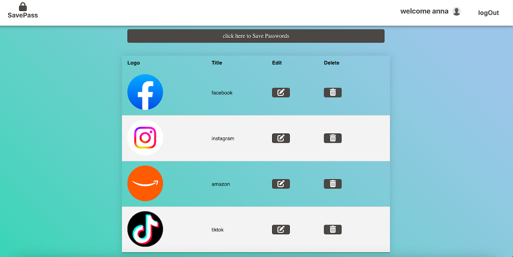

# Save Passwords

## Technologies used 
         
  

## About this app
SavePassword is responsible for storing the passwords of websites or social networks  and thus you only have to worry about one password, the SavePassword password.

### Characteristics
* Access from simple login and google account.
* Saving accounts and passwords.
* Editing of accounts.
* Deleting accounts.

## Setup
To run this project install it locally 
* cd client 
* npm start to start the client side
* cd  server 
* npm start to start the backend

## Setup
To run this project install it locally 
* cd client 
* npm start to start the client side
* cd  server 
* npm start to start the backend

## Configuration libraries
dotenv || To load the .env variables into the process environment. See [docs](https://www.npmjs.com/package/dotenv)  
prettier || To automatically format our code. See [docs](https://prettier.io/)  

### Client-side libraries
React-oauth/google || Sign up new users with just one tap, without interrupting them with a sign-up screen. Users get a secure, token-based, passwordless account on your site, protected by their Google Account..See [docs](https://www.npmjs.com/package/@react-oauth/google)  
React-spinner || A collection of loading spinners with React.js based on Halogen. See [doc](https://www.npmjs.com/package/react-spinners)  
React-router-dom || React Router enables "client side routing. See [docs](https://reactrouter.com/en/main/start/overview)  

## Server-side libraries
bcrypt || To hash passwords for security by incorporating salt method. See [docs](https://www.npmjs.com/package/bcrypt)  
jsonwebtoken || To generate user token signatures for authorization. See [docs](https://www.npmjs.com/package/jsonwebtoken)  
mysql || To add schemas to our database. See [docs](https://www.npmjs.com/package/mysql)  
mysql-migrations || databases can be transferred between the same or different instances.See [docs](https://www.npmjs.com/package/mysql-migrations)  
cors || A mechanism that allows restricted resources on a web page to be requested from another domain outside the domain from which the first resource was served..See [docs](https://www.npmjs.com/package/cors)  
google-auth-library|| authentication with Google APIs.See [docs](https://www.npmjs.com/package/google-auth-library)  
nodemone || nodemon is a tool that helps develop Node.js based applications by automatically restarting the node application when file changes in the directory are detected.See [docs](https://www.npmjs.com/package/nodemon)  

