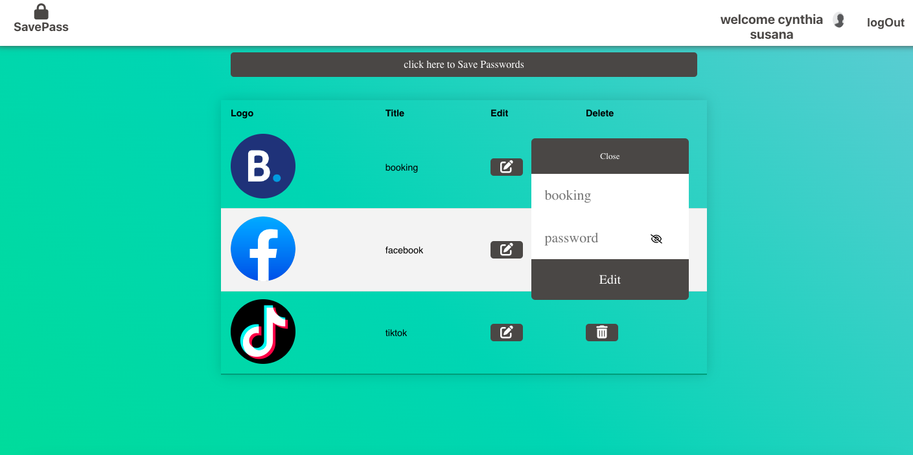

# Save Passwords

## technologies Used 
         
  

## About this app
SavePassword is responsible for storing the passwords of websites or social networks  and thus you only have to worry about one password, the SavePassword password.

## Characteristics
* Access from simple login and google account.
* Saving accounts and passwords.
* Editing of accounts.
* Deleting accounts.

## Setup
To run this project install it locally 
* cd client 
* npm start to start the client side
* cd  server 
* npm start to start the backend

